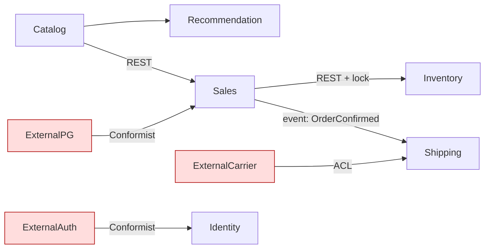

# Ecommerce Strategic Design - End-to-End Walkthrough Example

This document walks through a fictional ecommerce domain across all six phases. It helps first-time users understand the skill flow.

Real domains may lead to different decisions. Treat this as a process example, not the correct answer.

Example output path: `docs/ecommerce/strategic-design/`.

---

## Phase 0: Setup

**User**: "I want to do Strategic Design for an ecommerce system."

**Skill**:
- Domain name: `ecommerce`.
- Learning mode: Guided.
- Scope: "Online store: product display, ordering, payment, and shipping. Marketplace with multiple sellers is out of scope."
- Existing BC candidates: none.

Output: `docs/ecommerce/strategic-design/` directory plus empty STRATEGIC.md skeleton.

---

## Phase 1: Domain Discovery

**Q1. Who are the primary users?**
- User answer: Buyers/customers and admins/operations team.

**Q2. Core domain events?**
- User answer:
  - UserRegistered
  - ProductListedInCatalog
  - ItemAddedToCart
  - OrderCreated
  - PaymentCompleted
  - StockDeducted
  - ShipmentStarted
  - ShipmentDelivered
  - RefundRequested

**Q3. Key KPIs?**
- User answer: order conversion rate, average order value, repeat purchase rate.

**Q4. Differentiation?**
- User answer: fast shipping and curated product recommendations.

**Q5. Out of scope?**
- User answer: payment uses an external payment gateway, shipping is performed by carriers, and the system directly builds ordering, recommendation, and catalog only.

### Output: `01-discovery.md`

```markdown
# Phase 1: Domain Discovery

## One-Line Definition
Online store differentiated by fast shipping and curated product recommendation.

## Users
- Primary: buyers/customers
- Secondary: operators for product registration and order management

## Domain Events
- UserRegistered
- ProductListedInCatalog
- ItemAddedToCart
- OrderCreated
- PaymentCompleted
- StockDeducted
- ShipmentStarted
- ShipmentDelivered
- RefundRequested

## KPIs
- Order conversion rate
- Average order value
- Repeat purchase rate

## Scope
- In: account, catalog, recommendation, cart, order, inventory, shipment tracking
- Out: payment processing, actual carrier operation, marketplace
```

---

## Phase 2: Subdomain Classification

### Domain Expert Output

Based on business meaning:
- **Core**: Recommendation, Catalog curation.
- **Supporting**: Order, Cart, Inventory.
- **Generic**: Account, Payment, Shipment tracking.

### Product Owner Output

Based on business value:
- **Core**: Order, Recommendation.
- **Supporting**: Catalog, Cart, Inventory, Shipping.
- **Generic**: Account, Payment.

### Skill Difference Summary

| Area | Domain Expert | Product Owner |
|---|---|---|
| Order | Supporting | **Core** |
| Catalog | **Core** | Supporting |
| Recommendation | **Core** | **Core** |
| Shipment tracking | Generic | Supporting |

**User decision**: Order is Core because it directly drives revenue. Catalog is also Core because curation differentiates the product. Shipment tracking is Supporting because external carriers handle delivery but tracking still affects UX.

### Output: `02-subdomains.md`

| Subdomain | Type | Rationale | Differentiator |
|---|---|---|---|
| Recommendation | **Core** | conversion driver and differentiator | yes |
| Catalog | **Core** | curation is competitive | yes |
| Order | **Core** | directly tied to revenue | partial |
| Cart | Supporting | common pattern but affects UX | no |
| Inventory | Supporting | domain-specific but not differentiating | no |
| Shipment tracking | Supporting | external dependency, but UX impact | no |
| Account | Generic | can use external solution | no |
| Payment | Generic | external payment gateway | no |

---

## Phase 3: Bounded Context Identification

### Briefing

Ecommerce domain with eight Subdomains. Core: Recommendation, Catalog, Order. Supporting: Cart, Inventory, Shipment tracking. Generic: Account, Payment. Differentiators are fast shipping and curated recommendation.

### Four-Agent Initial Outputs

**Domain Expert**:
- **Catalog**: curated product display. `Product` means a display unit.
- **Recommendation**: recommendation candidates and user behavior data.
- **Sales**: ordering. `Product` becomes `OrderItem` with price and quantity.
- **Inventory**: stock. `Product` means SKU and location quantity.
- **Shipping**: shipment. `Order` becomes source data for fulfillment.
- **Identity**: account/login identity.

**Solution Architect**:

| BC Candidate | Cohesion Rationale |
|---|---|
| Catalog | product data changes slowly, high read traffic |
| Recommendation | depends on user behavior and product data, evolves independently |
| Order | sales transaction consistency |
| Inventory | high-frequency stock changes with its own consistency model |
| Shipping | external system integration, needs ACL |
| Identity | generic and should stay weakly coupled |

Dependencies: Recommendation -> Catalog, Sales -> Catalog, Sales -> Inventory, Shipping -> Sales, most BCs -> Identity.

**Tech Lead**:
Six BCs are reasonable. Recommendation can be owned by an ML team. Inventory needs strong consistency. Shipping should be async due to external APIs. Identity should use an external solution. Sales is the most complex and needs the largest team.

**Product Owner**:
Release order:
- **P0**: Catalog, Sales, Inventory, Identity.
- **P1**: Shipping.
- **P2**: Recommendation after usage data accumulates.

### Difference Summary

The four roles converge on six BCs: Catalog, Recommendation, Sales, Inventory, Shipping, Identity.

Conflict point:
- Domain Expert places Cart inside Sales.
- Architect briefly considers separate Cart but concludes Sales is more natural because Cart is temporary pre-checkout state.

### User Final Decision

> Decide on six BCs: Catalog, Recommendation, Sales, Inventory, Shipping, and Identity. Cart stays inside Sales because it is temporary pre-checkout state and does not have enough autonomous responsibility to be its own BC. Identity will be outsourced.

Output: `03-bounded-contexts.md` and `debates/bc-boundary-cart-vs-sales.md`.

---

## Phase 4: Context Map

### Solution Architect Output

| Upstream BC | Downstream BC | Pattern |
|---|---|---|
| Catalog | Recommendation | Customer/Supplier |
| Catalog | Sales | Customer/Supplier |
| Sales | Inventory | Customer/Supplier |
| Sales | Shipping | Published Language through OrderConfirmed event |
| ExternalPG | Sales | Conformist |
| ExternalAuth | Identity | Conformist |
| ExternalCarrier | Shipping | ACL |

### Tech Lead Output

| Relationship | Communication Mechanism | Reason |
|---|---|---|
| Catalog -> Recommendation | event: ProductUpdated | recommendation retraining is async |
| Catalog -> Sales | synchronous REST for price lookup | checkout needs current price |
| Sales -> Inventory | synchronous REST plus lock | stock deduction needs strong consistency |
| Sales -> Shipping | async event | shipping starts after payment and can be separate |
| ExternalPG -> Sales | REST + webhook | payment gateway standard |
| ExternalCarrier -> Shipping | REST polling | carrier API is external and translated by ACL |

### Mermaid



Output: `04-context-map.md`.

---

## Phase 5: Ubiquitous Language

### Catalog

| Term | Definition | Meaning in Other BCs |
|---|---|---|
| Product | A displayed selling unit with SKU, description, image, and current price. | In Sales, part of OrderItem. In Inventory, SKU plus location stock. In Recommendation, candidate item. |
| Category | Curated product grouping. | Catalog-only concept. |

### Sales

| Term | Definition | Meaning in Other BCs |
|---|---|---|
| Order | A set of products the customer intends to buy; states include PENDING, PAID, and CANCELLED. | In Shipping, source for Shipment. In Inventory, trigger for stock deduction. |
| Cart | Temporary collection before checkout, later converted into an Order. | Sales-only concept. |
| Customer | Person with purchase intent. | In Identity, Account. In Recommendation, behavior subject. |

### Inventory

| Term | Definition | Meaning in Other BCs |
|---|---|---|
| SKU | Stock-tracking unit that distinguishes product variants. | In Catalog, part of Product. In Sales, item identifier. |
| Stock | Available quantity by location. | Inventory-only concept. |

### Same Word, Different Meaning

- **Product**: Catalog display unit, Inventory SKU, Sales OrderItem, Recommendation candidate.
- **Customer**: payer in Sales, Account in Identity, behavior subject in Recommendation.
- **Order**: purchase intent in Sales, Shipment source in Shipping.

Output: `05-ubiquitous-language.md`.

---

## Phase 6: Consolidation and Reflection

The skill consolidates Phase 1-5 into `STRATEGIC.md` and asks three reflection questions.

### User Reflection Example

**Q1. Decision most different from initial intuition**:
> I initially wanted Cart to be a separate BC, but the Architect's autonomy argument convinced me to keep it inside Sales. I learned that BC boundaries are not noun boundaries; they are autonomous responsibility boundaries.

**Q2. What to do differently next time**:
> I should identify domain events more carefully in Phase 1. Missing refund and review events made Phase 3 feel less stable.

**Q3. Tactical Design impact**:
> In Sales BC, Aggregate candidates are Order as root and OrderItem as child Entity. Cart may be a separate Aggregate or an Order pre-state; that decision belongs in Tactical Design. Inventory likely has SKU-level Aggregate with concurrency as the core concern.

### Handoff

Strategic Design is complete. Next step is Tactical Design in `docs/ecommerce/DESIGN.md`, starting from BC-to-Aggregate mapping.

---

## Lessons from This Example

1. Four-agent outputs may converge or conflict. Conflict is the learning point.
2. Ambiguous areas such as Cart are where BC decisions become meaningful.
3. Same-word-different-meaning cases make BC boundaries easier to justify.
4. Weak Phase 1 discovery causes trouble in Phase 3.
5. Reflection is where learning consolidates; it must be user-written.

---

## Caution

This is a fictional example. A real ecommerce system may choose different boundaries, such as making Cart a separate BC. Focus on the reasoning process, not the exact result.
