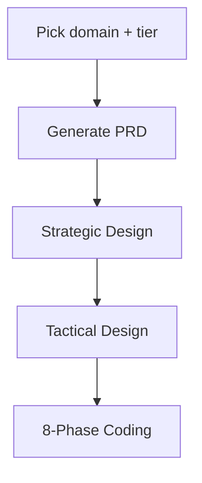

# NestJS DDD + CQRS Learning Platform

A personal learning platform for practicing **Domain-Driven Design (DDD)** and **NestJS** by repeating the same four-layer + CQRS architecture across multiple domains and difficulty tiers. Each session is called a **playthrough**.

This is a learning repository, not a starter template. Practice code, design notes, and PRDs live under `workspace/` and are Git-ignored.

> 🌱 **New to DDD?** Start with **[Getting Started with Domain-Driven Design](docs/getting-started-with-ddd.md)** — a beginner's introduction and a staged learning path (Basic → Intermediate → Advanced) that plugs directly into this platform.

---

## 🎯 Purpose

Two explicit learning goals:

1. **DDD learning** — Strategic Design (Bounded Context, Context Map, Ubiquitous Language, Subdomain classification) and Tactical Design (Aggregate, Entity, Value Object, Domain Service, Domain Event) across multiple domains.
2. **NestJS learning** — Application structure together with CQRS and four-layer architecture (`presenters` / `application` / `domain` / `infra`).

Every phase of the curriculum tracks both goals with a `Tests for This Layer` and a `NestJS Checkpoint` subsection.

---

## 📂 Directory Structure

```text
nestjs/                                # Platform root
├── CLAUDE.md                          # Agent instructions: purpose, rules, conventions
├── PLAN.md                            # 8-phase curriculum + tier model + pass criteria
├── PROGRESS.md                        # Playthrough workflow guide
├── docs/
│   └── domain-ideas/                  # PRD template repo: 9 domains x 3 tiers
├── .claude/                           # Agent definitions and the strategic-design skill
└── workspace/                         # [Git-ignored] Playthroughs
    └── <playthrough-name>/            # e.g., inventory-basic, forum-qa-advanced
        ├── product-requirements.md
        ├── docs/
        │   ├── strategic-design/      # Output of /strategic-design
        │   ├── DESIGN.md              # Tactical Design
        │   └── PROGRESS.md            # 8-phase checklist
        └── code/                      # NestJS implementation
```

---

## 📖 How a Playthrough Works



1. **Pick domain + tier** — choose one of nine domains in [docs/domain-ideas/](docs/domain-ideas/) and a tier (Basic / Intermediate / Advanced).
2. **Generate PRD** — copy the matching tier section into `workspace/<playthrough>/product-requirements.md`.
3. **Strategic Design** — run `/strategic-design --prd workspace/<playthrough>/product-requirements.md`. The skill runs a four-role multi-agent debate (Domain Expert, Solution Architect, Tech Lead, Product Owner) and outputs Bounded Contexts, a Context Map, and Ubiquitous Language. You write your own initial BC guess **before** the debate and a "what changed in my thinking" reflection **after**.
4. **Tactical Design** — write `workspace/<playthrough>/docs/DESIGN.md` covering Aggregate Decisions, Consistency Boundaries per Use Case, Service Placement, Domain Events, Value Objects, State Transitions, Use Cases, Business Rules, and Domain Exceptions. See [PLAN.md](PLAN.md) Phase -1.
5. **8-Phase Coding** — implement under `workspace/<playthrough>/code/` following the curriculum below. Write tests for each layer as you build it.

---

## 🧭 The 8-Phase Curriculum

| Phase | Focus | What You Build |
|---|---|---|
| 0 | Project Setup | Scaffold NestJS app, install dependencies (pinned), set path aliases |
| 1 | Domain Layer | VOs, Aggregate Roots, Domain Services, Factories — pure, no framework |
| 2 | Application Layer | Commands, Command Handlers, Queries, Query Handlers, Repository / Query Ports |
| 3 | Infrastructure Layer | ORM entities, Mapper, write Repository, read-only Query Repository, transactions |
| 4 | Presenters Layer | Request DTOs with validation, thin controllers |
| 5 | Module Wiring | Bind Ports to implementations, configure `AppModule` and `main.ts` |
| 6 | curl Integration Tests | Exercise the running app end-to-end |
| 7 | Domain Exception Handling | Domain exception hierarchy + global filter |
| 8 | Test Strategy Index | Cross-reference of the per-phase test slices |

Tests are written *during* each phase, not deferred. Phase 8 is just a one-page index of how the layer-by-layer tests fit together.

---

## 🏗️ Architecture

```text
  [ Presenters ]  →  HTTP, Controllers, Request DTOs, exception filter
        │
        ▼
  [ Application ] →  Command/Query Handlers, Service facade, Ports (write + read)
        │
        ▼
  [ Domain ]      ←  Aggregate Roots, Entities, VOs, Domain Services, Factories (pure)
        ▲
        │ implements Ports
  [ Infra ]       →  TypeORM entities, Mapper, Repository (write), Query Repository (read)
```

### CQRS Split

The write and read paths take **different routes** through the stack:

- **Write path**: Controller → Command Handler → load Aggregate via Repository → call domain method → save via Repository.
- **Read path**: Controller → Query Handler → Query Port → ORM → Read Model DTO. **The domain layer is bypassed entirely** — no `reconstitute()`, no Mapper. Queries denormalize directly in SQL.

### Core Rules

- No TypeORM or NestJS imports in `domain/`, except `@Injectable` on Factories and Domain Services.
- No `infra/` imports in `application/`.
- Ports are `abstract class` so they survive compilation and work as DI tokens.
- A module is the only place where a Port is bound to an implementation.
- Transaction context propagates via CLS / `@Transactional()` (from `typeorm-transactional`). `application/` never imports `EntityManager` or `QueryRunner`.
- Query Handlers depend on a Query Port and return Read Model DTOs — never call `reconstitute()`.
- Module dependencies between BCs are unidirectional or event-driven. `forwardRef()` signals a design problem, not a fix.

### Service Placement

A frequent confusion: where does a piece of business logic live?

| Layer | Owns Business Rules? | Use For |
|---|---|---|
| Domain method on an Aggregate Root | Yes | Rules that fit inside one Aggregate |
| Domain Service (`domain/services/`) | Yes | Rules that compare or coordinate two or more Aggregates |
| Application Service / Command Handler | No | Loading Aggregates, calling external systems, saving, transaction control |

Domain Services never inject repositories; the Application Service loads the Aggregates and passes them in.

---

## 🎚️ Tier Model

Each tier has a clear scope and **pass criteria** — a "you've completed this tier" signal, not a grade.

| Tier | Scope | Sample Pass Criteria |
|---|---|---|
| **Basic** | 1 Aggregate, simple state machine, single BC | Zero NestJS/TypeORM imports in `domain/`; Query Handler never calls `reconstitute()`; one happy-path + one invariant-violation e2e test |
| **Intermediate** | 2 Aggregates, 1–2 BCs, cross-aggregate validation | DESIGN.md "Service Placement" filled in; multi-repository writes wrapped by a single `@Transactional()`; no `EntityManager` in `application/` |
| **Advanced** | 3+ Aggregates, 2+ BCs, Domain Events, Saga | At least one Domain Event published via Transactional Outbox; Saga tested for retry and duplicate delivery; no `forwardRef()` used to break BC cycles |

Full pass criteria are in [PLAN.md](PLAN.md) under "Three Tiers > Pass Criteria".

---

## 🧠 Strategic Design Skill

`/strategic-design` runs a four-role multi-agent discussion. It supports two modes:

- **PRD mode** (recommended for the curriculum): `/strategic-design --prd workspace/<playthrough>/product-requirements.md`. The skill pre-fills Phase 0/1 from the PRD's discovery answers. You write `initial-bc-guess.md` before the debate, and a "What changed in my thinking" reflection comparing it to the final BCs at the end.
- **Socratic mode**: `/strategic-design <domain>`. The skill asks the five Phase 1 questions one at a time.

Core principle: **AI presents options; the user decides at every phase.** Reflection is always written by the user, never ghostwritten.

See [.claude/skills/strategic-design/SKILL.md](.claude/skills/strategic-design/SKILL.md) for full details.

---

## 🛠️ Getting Started

### Prerequisites

- Node.js 18+
- npm

### Setup

There is no root `package.json`. Each playthrough is its own NestJS app under `workspace/<playthrough>/code/`. Install inside the playthrough you are working on:

```bash
cd workspace/<playthrough>/code
npm install
npm run start:dev
```

Phase 0 in [PLAN.md](PLAN.md) lists the exact dependencies and the `--save-exact` convention used by this project.

---

## 📚 Where Things Are

- **DDD primer**: [docs/getting-started-with-ddd.md](docs/getting-started-with-ddd.md) — beginner's introduction to DDD + a staged learning path that maps onto the tiers and examples here.
- **Worked examples**: [examples/order-management-basic/](examples/order-management-basic/) (Basic) and [examples/order-management-intermediate/](examples/order-management-intermediate/) (Intermediate) — committed reference implementations.
- **Curriculum and rules**: [PLAN.md](PLAN.md) — 8 phases, tier pass criteria, Advanced Topics (Transactional Outbox), Shared Architecture Rules.
- **Workflow guide**: [PROGRESS.md](PROGRESS.md) — how to start a new sub-project.
- **Agent instructions**: [CLAUDE.md](CLAUDE.md) — how AI agents should collaborate inside this repo, including language conventions.
- **Domain ideas**: [docs/domain-ideas/](docs/domain-ideas/) — nine domains, three tiers each.
- **Strategic Design skill**: [.claude/skills/strategic-design/](.claude/skills/strategic-design/).
