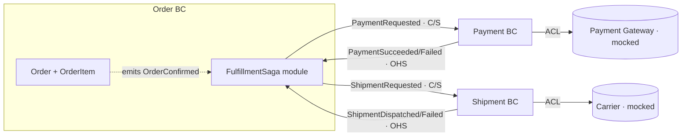

# Phase 4 — Context Map

Roles: **Solution Architect** (relationship patterns + direction) + **Tech Lead** (communication mechanisms).

## Diagram

## Relationship Details

| Upstream BC | Downstream BC | Pattern | Communication Mechanism | Notes |
|---|---|---|---|---|
| Order BC (saga) | Payment BC | Customer/Supplier + Published Language | Async event via outbox → relay → handler (`PaymentRequested`) | Order owns the command-event contract; Payment conforms to the shape |
| Order BC (saga) | Shipment BC | Customer/Supplier + Published Language | Async event via outbox → relay → handler (`ShipmentRequested`) | Same structure |
| Payment BC | Order BC (saga) | Open Host Service + Published Language | Async event via outbox (`PaymentSucceeded` / `PaymentFailed`) | Saga handler translates incoming events (acts as ACL); Payment never imports Order |
| Shipment BC | Order BC (saga) | Open Host Service + Published Language | Async event via outbox (`ShipmentDispatched` / `ShipmentFailed`) | Same structure |
| Payment Gateway (external, mocked) | Payment BC | Anti-Corruption Layer | Adapter in Payment `infra/` | Gateway data model never leaks into the Payment domain |
| Carrier (external, mocked) | Shipment BC | Anti-Corruption Layer | Adapter in Shipment `infra/` | Carrier data model never leaks into the Shipment domain |

## Communication Mechanism Decisions

- **Events, not cross-BC commands.** The saga issues `PaymentRequested` / `ShipmentRequested` by writing to the outbox; it does **not** call another BC's `CommandBus` directly. A direct cross-BC command call would force the saga to import the target's command type and catch its synchronous failures — coupling, not coordination.
- **Transactional Outbox.** Every state change writes the aggregate row **and** its event row in one `@Transactional()`. A shared `OutboxRelayService` (`@Interval` poll of `published_at IS NULL`, publish via in-process `EventBus`, then stamp `published_at` in a separate transaction) delivers at-least-once.
- **Idempotent handlers.** Each subscriber checks a `processed_events` table (key: `orderId` / `paymentId` / `shipmentId` + event type) inside the same `@Transactional()` as its aggregate write, so re-delivery is a no-op.
- **Cross-BC reads — denormalize into Order (user's decision).** No synchronous cross-BC query port (a departure from the intermediate tier's `PaymentStatusQueryPort`). The saga writes a denormalized `paymentStatus` / `shipmentStatus` onto the Order read model when it handles result events; `GetOrderQuery` reads Order's own table. No cross-BC join or sync call at query time.

## Context Map Rationale (summary of the user's decision)

The user approved the full pattern set: Order→Payment and Order→Shipment as **Customer/Supplier** (Order drives the contract via the saga), the result events back as **Open Host Service / Published Language** with the saga's handlers acting as the translating ACL, and both external integrations behind an **Anti-Corruption Layer**. The acyclic guarantee rests on the fact that Payment and Shipment never import Order code — they only publish events onto the bus, and the saga inside Order is the sole component aware of both sides. For cross-BC reads, the user chose to **denormalize** payment/shipment status into the Order read model rather than reuse the intermediate tier's synchronous query port, keeping the advanced playthrough consistently event-driven and avoiding hidden synchronous coupling.
