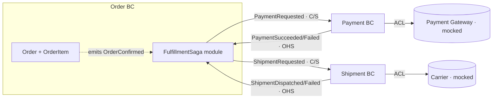

# Order Management Strategic Design

> This document defines Bounded Contexts, Context Map, and Ubiquitous Language.
> Tactical Design such as Aggregates and VOs belongs in `../DESIGN.md`.
> Process notes are in `01-discovery.md` through `05-ubiquitous-language.md`.
> Raw debate notes are in `debates/`.

---

## 1. Domain Overview

**One-line domain definition**: A system where a customer places an Order and its fulfillment is driven across three Bounded Contexts — Order, Payment, and Shipment — collaborating asynchronously through Domain Events (Transactional Outbox + Saga), with eventual consistency, idempotent handlers, and compensation flows.

### Users
- **Primary users**: Customer — places, confirms, and cancels orders; tracks fulfillment status.
- **Secondary users**: Operator — manual payment retry, manual refund, intervention on stuck sagas. Scheduler / system actor — drives retries, timeouts, and the outbox relay.

### Core Domain Events
- OrderPlaced, OrderConfirmed, OrderCancelled
- PaymentRequested, PaymentSucceeded, PaymentFailed, RefundIssued
- ShipmentDispatched, ShipmentFailed
- OrderShipped, OrderDelivered
- OrderTimedOut

### Key KPIs
- N/A (learning project).

### Differentiation
N/A (learning project). Learning focus: multi-BC Domain Events, fulfillment Saga / Process Manager, eventual consistency, Transactional Outbox, idempotent handlers, Anti-Corruption Layer.

### Out of Scope
Real payment gateway / carrier calls (mocked, behind ACL); UI/UX; inventory / stock-reservation Saga; authentication; notifications (events are still published for a future Notification consumer).

---

## 2. Subdomain Classification

| Subdomain | Type | Business-Value Rationale | Differentiator |
|---|---|---|---|
| Order | **Core** | Richest domain vocabulary; the lifecycle is the spine every event is framed against. | yes |
| Fulfillment Orchestration (Saga) | **Core** | Encodes *what must happen and what must be undone* — happy path, compensation, timeout. The defining complexity of the advanced tier. | yes |
| Payment | Supporting | Real internal complexity but exists in service of the Order lifecycle; refund is a Payment state transition. | no |
| Shipment | Supporting | Own state machine, but its purpose is "did the customer receive the order?" | no |
| External Integrations (mocked gateway + carrier) | Generic | Off-the-shelf in reality; zero differentiation; reached only through an ACL. | no |

**Classification rationale**: Both the Domain Expert and Product Owner independently surfaced **Fulfillment Orchestration** as a distinct Core subdomain not in the initial guess. Recorded nuance: a subdomain is **not** a Bounded Context — the saga is implemented *inside* the Order BC, so this Core subdomain does not become its own deployable context. The mocked gateway + carrier form a **Generic** subdomain behind an ACL. Refund / Compensation is absorbed into Payment (a state transition) + the saga (which decides when to compensate). See [02-subdomains.md](02-subdomains.md).

---

## 3. Bounded Contexts

### BC-1: Order
- **Responsibility**: Owns the customer's purchase intent and the Order lifecycle (PENDING → CONFIRMED → PENDING_SHIPMENT → SHIPPED → DELIVERED; CANCELLED via cancel / compensation / timeout). Owns `Order` + `OrderItem`. **Hosts the Fulfillment Saga** as a separate `FulfillmentSagaModule` within this BC, driving compensating commands, timeouts, and retries.
- **Included concepts**: Order, OrderItem, order state machine, order total, confirm/cancel, FulfillmentSaga (correlation, in-flight state, timeouts), OrderTimedOut.
- **Excluded concepts**: payment settlement (Payment BC), physical movement / carrier tracking (Shipment BC), the mocked gateway/carrier models (behind ACLs).
- **Owning Subdomain**: Core (Order) + Core (Fulfillment Orchestration).
- **Autonomy level**: independently deployable. Saga is a separate *module within* the BC, not a separate BC.

### BC-2: Payment
- **Responsibility**: Owns settling an obligation for an order. Handles `PaymentRequested`, produces `PaymentSucceeded` / `PaymentFailed`, issues `RefundIssued` on compensation. Wraps the mocked gateway behind an ACL.
- **Included concepts**: Payment aggregate, payment state machine (REQUESTED → SUCCEEDED → REFUNDED; REQUESTED → FAILED), charge amount, refund, gateway ACL.
- **Excluded concepts**: order lifecycle and *when* to compensate (Order BC / saga); shipment.
- **Owning Subdomain**: Supporting (Payment) + Generic (gateway integration).
- **Autonomy level**: independently deployable. References Order by `orderId` only.

### BC-3: Shipment
- **Responsibility**: Owns the physical movement of goods. Handles dispatch, produces `ShipmentDispatched` / `ShipmentFailed`, tracks delivery. Wraps the mocked carrier behind an ACL.
- **Included concepts**: Shipment aggregate, shipment state machine (PENDING → DISPATCHED → DELIVERED; PENDING → FAILED), tracking/carrier status, carrier ACL.
- **Excluded concepts**: payment/refund (Payment BC); order intent and saga orchestration (Order BC).
- **Owning Subdomain**: Supporting (Shipment) + Generic (carrier integration).
- **Autonomy level**: independently deployable. References Order by `orderId` only.

> **Shared infrastructure (not a BC)**: a `OutboxModule` (single `outbox_events` table + relay). Each BC appends event rows in the same `@Transactional()` as its aggregate change; one relay delivers at-least-once; subscribers dedupe on an idempotency key.

### BC Split Decision Rationale, Written by User
- Order: Order has its own state transitions. Also it is the core entity that drives other entities. Saga management of state transitions are mainly related to Order state in the end.
- Payment: It has its own state transitions.
- Shipment: It has its own state transitions.

Raw debate: [debates/bc-boundary-saga-placement.md](debates/bc-boundary-saga-placement.md)

---

## 4. Context Map

### Relationship Details

| Upstream BC | Downstream BC | Pattern | Communication Mechanism | Notes |
|---|---|---|---|---|
| Order BC (saga) | Payment BC | Customer/Supplier + Published Language | Async event via outbox (`PaymentRequested`) | Order owns the command-event contract |
| Order BC (saga) | Shipment BC | Customer/Supplier + Published Language | Async event via outbox (`ShipmentRequested`) | Same structure |
| Payment BC | Order BC (saga) | Open Host Service + Published Language | Async event via outbox (`PaymentSucceeded`/`Failed`) | Saga handler translates (acts as ACL); Payment never imports Order |
| Shipment BC | Order BC (saga) | Open Host Service + Published Language | Async event via outbox (`ShipmentDispatched`/`Failed`) | Same structure |
| Payment Gateway (ext) | Payment BC | Anti-Corruption Layer | Adapter in Payment `infra/` | Gateway model never leaks inward |
| Carrier (ext) | Shipment BC | Anti-Corruption Layer | Adapter in Shipment `infra/` | Carrier model never leaks inward |

### Context Map Rationale
The saga issues **events, not direct cross-BC commands**; every state change writes the aggregate + outbox row in one `@Transactional()`; a shared relay delivers at-least-once and handlers dedupe on an idempotency key. Cross-BC reads are handled by **denormalizing** `paymentStatus` / `shipmentStatus` onto the Order read model (the user's decision — a departure from the intermediate tier's synchronous `PaymentStatusQueryPort`), keeping the design consistently event-driven. The cycle stays acyclic because Payment/Shipment never import Order — they only publish events, and the saga inside Order is the sole component aware of both sides. See [04-context-map.md](04-context-map.md).

---

## 5. Ubiquitous Language

Full glossaries per BC: [05-ubiquitous-language.md](05-ubiquitous-language.md).

### Same Word, Different Meaning
- **Pending** — Order: first state; Shipment: waiting on carrier; Payment's equivalent is REQUESTED. A shared `pending` enum hides which boundary you're in.
- **Confirmed** — Order: payment *requested*, not settled. "Only ship confirmed orders" must check `Payment.status = SUCCEEDED`, not `Order.status = CONFIRMED`, or goods ship before payment clears.
- **Amount** — Order: frozen line-item sum; Payment: authorized charge; diverges after a partial refund. Never one shared field.
- **Cancel vs Refund** — Order cancel ≠ Payment refund; a cancellation produces no refund if payment never settled.
- **Failed** — Payment-failed (gateway declined) ≠ Shipment-failed (carrier couldn't dispatch); the saga must branch on which BC emitted it.

---

## 6. Learning Reflection, Written by User

### What Changed in My Thinking (PRD mode)

I didn't clearly understand what subdomain is and what BC is. I understand it now.

(For reference: all three initial guesses — Order, Payment, Shipment — survived as BCs. What the debate added was the **Fulfillment Orchestration** Core subdomain, which did not become its own BC but lives inside the Order BC as a module; and the **Outbox** as shared infrastructure, not a subdomain.)

### Q1. One decision most different from your initial intuition

Saga is in the subdomain.

### Q2. What would you do differently next time?

I will think with domain expert's head not tech lead.

### Q3. How does this affect Tactical Design (`DESIGN.md`)?

I understand now that subdomain and BC are not one and one matches.

---

## Appendix

- Phase notes:
  - [01-discovery.md](01-discovery.md) -- Phase 1
  - [initial-bc-guess.md](initial-bc-guess.md) -- Phase 1 (user's pre-debate BC guess)
  - [02-subdomains.md](02-subdomains.md) -- Phase 2
  - [03-bounded-contexts.md](03-bounded-contexts.md) -- Phase 3
  - [04-context-map.md](04-context-map.md) -- Phase 4
  - [05-ubiquitous-language.md](05-ubiquitous-language.md) -- Phase 5
- Raw debate notes: [debates/](debates/)

---

## Next Step

This Strategic Design is the starting point for Tactical Design in `../DESIGN.md`.
Next step: design Aggregates, VOs, and Entities for implementing each BC.
