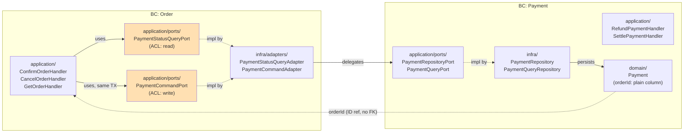

# Phase 4 — Context Map

**Decision date**: 2026-05-29
**Decided by**: User (Ken)

## Relationship Pattern

| Direction | Pattern | Rationale |
|---|---|---|
| **Order → Payment** | Customer/Supplier (U=Payment, D=Order) + **ACL at Port boundary** | Order is the downstream consumer of Payment. Two Ports (`PaymentStatusQueryPort` for read, `PaymentCommandPort` for write) defined in Order's application layer act as the ACL. They translate Payment's internal model/Command structure into Order's language |
| **Payment → Order** | No runtime dependency | Payment only stores `orderId` as a plain column. It does not know Order's model/module |

## Mermaid Diagram



> Solid lines: active runtime calls. Dashed lines: Port binding or ID reference (not a module import).

## Decisions Finalized in Phase 4

### D4: Add PaymentCommandPort (A)

In addition to Phase 3's `PaymentStatusQueryPort`, introduce a **second Cross-BC Port**.

- **Name**: `PaymentCommandPort`
- **Location**: `src/order/application/ports/payment-command.port.ts`
- **Method (tentative)**: `createPayment(orderId: OrderId, amount: Money): Promise<void>`
- **Implementation**: `PaymentCommandAdapter` in `src/order/infra/adapters/`. Injects Payment's `PaymentRepositoryPort` and delegates.
- **Effect**:
  - Both read and write pass through a Port → symmetric ACL
  - Order does not directly know Payment's Command/Repository structure
  - When Payment is split into a separate service in the Advanced tier, only the one `PaymentCommandAdapter` class is swapped to HTTP/gRPC → the key payoff point of the Cross-BC Port pattern

### D5: Allow the Refund inconsistency window (A — PRD intent)

- If, after the Operator runs Refund, the Cancel Order action fails, a *Payment REFUNDED + Order CONFIRMED* inconsistent state can temporarily exist.
- In this tier it is stated as a limitation **handled by manual retry/correction**.
- It is resolved with Saga compensation in the Advanced tier (a natural evolution path).

## Module Wiring (Reference)

```text
OrderModule
  imports:   [CqrsModule, TypeOrmModule.forFeature([OrderOrmEntity, OrderItemOrmEntity]), PaymentPortsModule]
  providers: [
    OrderService, OrderFactory, OrderMapper,
    CreateOrderCommandHandler, ConfirmOrderCommandHandler, CancelOrderCommandHandler,
    GetOrderQueryHandler,
    { provide: OrderRepositoryPort,     useClass: OrderRepository },
    { provide: OrderQueryPort,          useClass: OrderQueryRepository },
    { provide: PaymentCommandPort,      useClass: PaymentCommandAdapter },
    { provide: PaymentStatusQueryPort,  useClass: PaymentStatusQueryAdapter },
  ]
  exports: []

PaymentModule
  imports:   [CqrsModule, TypeOrmModule.forFeature([PaymentOrmEntity])]
  providers: [
    PaymentService, PaymentMapper,
    SettlePaymentCommandHandler, RefundPaymentCommandHandler,
    GetPaymentQueryHandler,
    { provide: PaymentRepositoryPort, useClass: PaymentRepository },
    { provide: PaymentQueryPort,      useClass: PaymentQueryRepository },
  ]
  exports: [PaymentRepositoryPort]   // exported for PaymentCommandAdapter

PaymentPortsModule   # src/payment/payment-ports.module.ts
  imports:   [PaymentModule]
  providers: [PaymentCommandAdapter, PaymentStatusQueryAdapter]
  exports:   [PaymentCommandAdapter, PaymentStatusQueryAdapter]
```

> `PaymentPortsModule` is an intermediate module that lets `OrderModule` pull in only the two Adapters, without importing `PaymentModule` wholesale.

## Transaction Propagation

- A single `@Transactional()` on `ConfirmOrderCommandHandler.execute()`.
- CLS opens one connection-level TX, and `OrderRepository.save()` and `PaymentCommandAdapter.createPayment()` (which internally calls `PaymentRepositoryPort.save()`) share the same DataSource connection.
- **Prerequisite**: `initializeTransactionalContext()` is called in `main.ts`, and `TypeOrmModule.forRootAsync({ dataSourceFactory: ... addTransactionalDataSource(...) })`. Without it the two writes go to different connections and TX isolation breaks.

## Coupling Analysis

| Coupling axis | Current state | Change-propagation direction |
|---|---|---|
| Payment-creation interface | Passes through the `PaymentCommandPort.createPayment(orderId, amount)` contract. The Adapter calls Payment's Command | Payment → Adapter → Port (Order domain code is unaffected) |
| PaymentStatus vocabulary | `PaymentStatusQueryPort` returns a read model defined on the Order side. Even if Payment's internal enum changes, the Adapter absorbs it | The ACL blocks it |
| `orderId` format | Payment stores it as a plain string. If the OrderId format changes (e.g. UUID → ULID), the Payment column/query must change | Order → Payment (crosses the boundary) |

The strongest coupling is **D1 (same TX)** — the two Repositories are bound in one TX. This holds only under the *single-monolith + single-DB* assumption. There is a cost when splitting in the Advanced tier.

## Failure Modes

- **Payment Port throws on Confirm**: `PaymentCommandAdapter.createPayment()` throws → the exception propagates out of `ConfirmOrderCommandHandler.execute()` → `@Transactional()` rolls back the connection TX → the Order write is also rolled back. No partial state.
- **Operator Refund fails**: Payment became REFUNDED but the Order Cancel failed → because the two TXs are independent, there is no automatic Order rollback. An inconsistency occurs. **Per D5, allowed in this tier via manual retry/correction**. Evolves to Saga compensation in the Advanced tier.

## Conformist / ACL Risk

| Risk point | Mitigation |
|---|---|
| The `PaymentStatus` enum leaks into Order domain code | Force the `PaymentStatusQueryPort` return type to be a *read model defined on the Order side*. Do not pass Payment's enum through as-is |
| The `PaymentCommand` signature leaks into Order | Write the `PaymentCommandPort` method signature in Order's domain expression (`createPayment(orderId, amount)`). Keep Payment's internal Command object unknown to Order |
| `orderId` format coupling | Low. When the OrderId VO is serialized to a string, the Payment column receives it as a plain string. Do the explicit conversion in one place |

## Summary

| Item | Conclusion |
|---|---|
| BC relationship | Customer/Supplier (Order=D, Payment=U) + ACL on the Order side |
| Cross-BC Ports | 2 — `PaymentStatusQueryPort` (read), `PaymentCommandPort` (write) |
| Dependency direction | One-way Order → Payment (Payment stores only orderId as plain) |
| Transaction | Same monolith/DB → one `@Transactional()` bundles Order+Payment creation |
| Inconsistency window | Between Refund and Cancel — stated as a manual-handling limitation |
| Evolution path | Adapter swap + Saga compensation in the Advanced tier |
