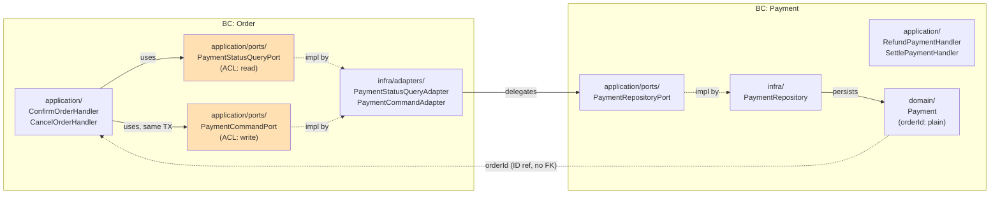

# Strategic Design — Order Management (Intermediate)

**Playthrough**: order-management-intermediate
**Mode**: PRD mode (Guided)
**Started**: 2026-05-28
**Completed**: 2026-05-29

## Status

- [x] Phase 0 — Setup
- [x] Phase 1 — Domain Discovery (PRD validation)
- [x] Phase 2 — Subdomain Classification
- [x] Phase 3 — Bounded Context Identification
- [x] Phase 4 — Context Map
- [x] Phase 5 — Ubiquitous Language
- [x] Phase 6 — Consolidation & Reflection

## Artifacts

- [initial-bc-guess.md](initial-bc-guess.md) — pre-debate BC guesses (preserved as-is)
- [01-discovery.md](01-discovery.md)
- [02-subdomains.md](02-subdomains.md)
- [03-bounded-contexts.md](03-bounded-contexts.md)
- [04-context-map.md](04-context-map.md)
- [05-ubiquitous-language.md](05-ubiquitous-language.md)

---

## 1. Subdomains

| # | Subdomain | Classification | Responsibility |
|---|---|---|---|
| S1 | **Order Fulfillment** | Core | Decides what the Customer ordered and what state it is in. Owns the Order lifecycle. |
| S2 | **Payment Settlement** | Supporting | Manages the request/settlement/refund state of payments for an Order. Has its own business rules but is not a differentiating area. |

→ Detailed rationale: [02-subdomains.md](02-subdomains.md)

## 2. Bounded Contexts

| BC | Aggregate | Subdomain | NestJS Module |
|---|---|---|---|
| **Order** | `Order` (with `OrderItem` child) | Order Fulfillment | `OrderModule` |
| **Payment** | `Payment` | Payment Settlement | `PaymentModule` |

**Lifecycles**:
- Order: PENDING → CONFIRMED → SHIPPED, CANCELLED
- Payment: REQUESTED → SUCCEEDED, FAILED, REFUNDED

**Key Cross-BC Decisions**:
- **D1**: Order confirmation + new Payment creation are in the **same transaction**
- **D2**: `PaymentStatusQueryPort` (read) — defined in Order's application/ports/
- **D3**: Refund and Order Cancel are **independent Operator Commands**, not an automatic Saga
- **D4**: `PaymentCommandPort` (write) — defined in Order's application/ports/ (ACL symmetry)
- **D5**: The inconsistency window between Refund and Cancel is *stated as a limitation of this tier*

→ Detailed rationale: [03-bounded-contexts.md](03-bounded-contexts.md)

## 3. Context Map

**Pattern**:
- Order → Payment: **Customer/Supplier (U=Payment, D=Order) + ACL** via two Ports
- Payment → Order: **No runtime dependency** (orderId plain column only)

→ Detailed rationale and module wiring: [04-context-map.md](04-context-map.md)

## 4. Ubiquitous Language Highlights

### Polysemy Map

| Word | Order BC | Payment BC |
|---|---|---|
| **Cancel** | `cancelOrder` / `OrderCancelled` (withdraw intent) | (none — absorbed by `PaymentFailed`) |
| **Refund** | only receives `RefundIssued`; no `refund` method | `issueRefund` / `RefundIssued` (financial event, owner) |
| **Approve** | `confirm` (Customer confirmation) | `succeed` (PSP approval, mechanical result) |

### Anti-Vocabulary

- **Forbidden in Order**: `PaymentStatus`, `PaymentRequested/Succeeded/Failed`, `REFUNDED`, `issueRefund`
- **Forbidden in Payment**: `OrderStatus`, `OrderItem`, `OrderTotal`, `confirmOrder`, `shipOrder`
- **Translation rule**: `PaymentSucceeded` (Payment language) → `isReadyToShip` (Order language); the boundary is `PaymentStatusQueryPort`

### Event Ownership

- Published by Order BC: `OrderPlaced`, `OrderConfirmed`, `OrderCancelled`, `OrderShipped`
- Published by Payment BC: `PaymentRequested`, `PaymentSucceeded`, `PaymentFailed`, `RefundIssued`

> Note: `OrderShipped` is for this tier only. In the Advanced tier it may be split into `ShipmentDispatched` (Shipment BC).

→ Full glossary: [05-ubiquitous-language.md](05-ubiquitous-language.md)

---

## 5. Reflection (written by user)

### What changed in my thinking

> I wasn't able to distinguish Actor from BC, so I had classified actors as BCs.

**Reference — initial guess vs final BCs** (auxiliary table):

| User's initial guess (2026-05-28) | Final result | Type of change |
|---|---|---|
| customer | (none) | Reclassified as an Actor — not a BC |
| operator | (none) | Reclassified as an Actor — not a BC |
| order | Order BC | Kept |
| payment | Payment BC | Kept |
| shipment | (none) | Out of scope for this tier — absorbed as the SHIPPED status flag inside Order |

→ Of the initial 5, only 2 survived as BCs, 2 were reclassified as Actors, and 1 was put out of scope.

### Most surprising finding

> How to distinguish Upstream/Downstream.

(Interpreted as: in Phase 4's Customer/Supplier pattern, the criterion for which side is U (Upstream) and which is D (Downstream) — the reason Order becomes the downstream consumer of Payment — was new.)

### Open questions

> None

---

## 6. Handoff — Next Steps

Strategic Design is complete. The next step is **Tactical Design** (concrete design of Aggregates, Entities, VOs, and Domain Services).

### Recommended Path

1. **Write Tactical Design**: `workspace/order-management-intermediate/docs/DESIGN.md`
   - Fields, method signatures, and VO definitions for each Aggregate
   - State-machine method definitions (`create`, `confirm`, `cancel`, `ship` for Order; `request`, `succeed`, `fail`, `refund` for Payment)
   - Port method signatures (`PaymentCommandPort.createPayment`, `PaymentStatusQueryPort.getStatus`)
   - Cross-Aggregate Domain Service: define `PaymentCoordinator`
   - See Phase -1 of this project's `PLAN.md`

2. **Create PROGRESS.md**: `workspace/order-management-intermediate/docs/PROGRESS.md`
   - The 8-phase coding checklist

3. **8-phase coding**: `workspace/order-management-intermediate/code/`
   - Proceed in order through `PLAN.md` Phases 1–8
